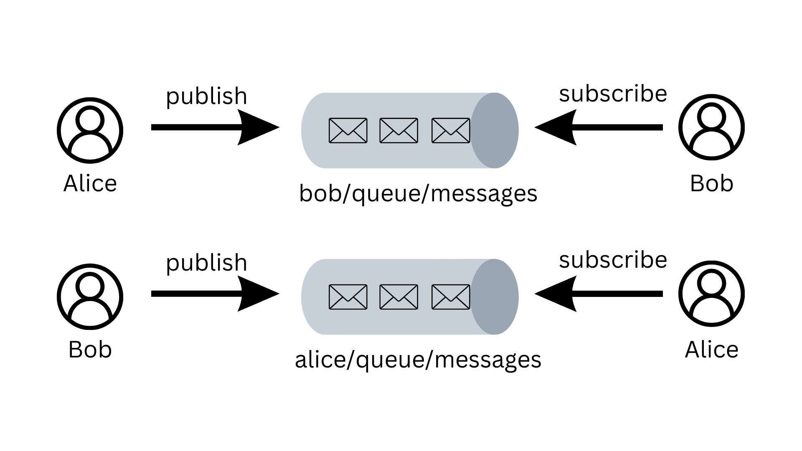
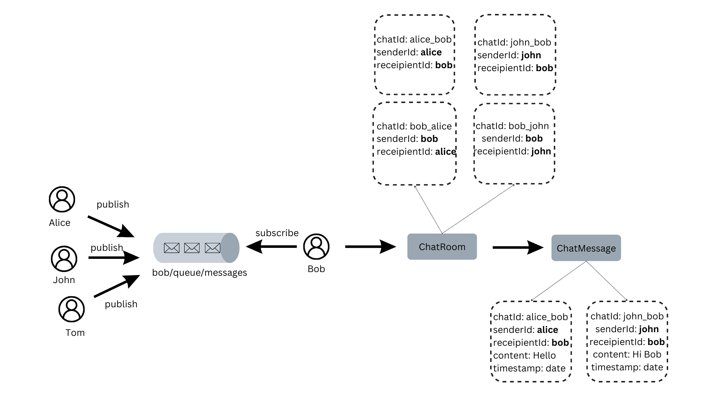

# Instant Messaging Backend

## Overview

The Instant Messaging Backend is a project that provides the server-side functionality for an instant messaging application. It facilitates real-time communication between users, handling message processing, storage, and delivery.

## System design

## 

## 

## Prerequisites

Ensure that your development environment meets the following requirements:

- Docker
- Java Development Kit (JDK)

## Getting Started

Follow these steps to set up and run the project locally:

1. **Run Docker Compose:**
   Start the necessary services using Docker Compose:

   ```bash
   docker-compose -f docker-compose.yml up -d
   ```

2. **Build the project:**

   ```bash
   ./mvnw clean install
   ```

3. **Run the Java Project**

4. Once the application is running, access mongodb in your web browser at http://localhost:8081.

Code referenced from https://github.com/ali-bouali/one-to-one-chat-spring-boot-web-socket/tree/main
